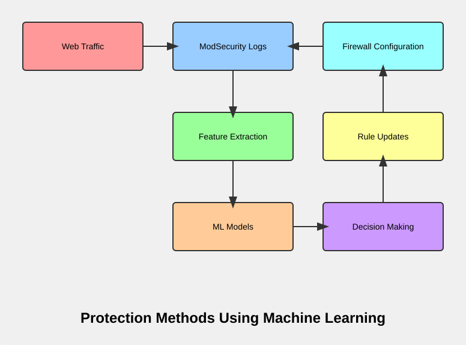

# Apache ModSecurity Log Parser

These scripts analyze ModSecurity logs in SecAuditLogType Concurrent mode within Apache mod_security 2.x, providing real-time analysis capabilities and protection against DDoS attacks. The script operates at layer 7 of the OSI model, tracking bots and identifying suspicious behavior. Upon detecting malicious activity, it triggers a block at layer 3 of the OSI model using fail2ban and iptables, blocking the IP addresses of attackers at the network level. This approach enables rapid response to attacks, effectively safeguarding your server. 


[На Русском](README_RU.md)

## Overview

- [Description of the mod_sec_log_parser.py Script](#Description-of-the-mod_sec_log_parser-Script)
- [Description of ModSecurity Audit Log Fields Extracted by the Script](#Description-of-ModSecurity-Audit-Log-Fields-Extracted-by-the-Script)
- [Description of the Mutex Parameter in Apache Configuration](#Description-of-the-Mutex-Parameter-in-Apache-Configuration)
- [Description of the watch_dir.sh Script](#Description-of-the-watch_dir-Script)
- [Description of the modsec_recedive.sh script blocking DDoS attack](#Description-of-the-modsec_recedive-script-blocking-DDoS-attack)
- [Example of using Fail2ban](#Example-of-using-Fail2ban)
- [Web Server Security System](#Web-Server-Security-System)
- [Protection Methods Using Data from ModSecurity Logs](#Protection-Methods-Using-Data-from-ModSecurity-Logs)
- [Examples of blocking or limiting at the iptables level](#Examples-of-blocking-or-limiting-at-the-iptables-level)
- [Protection Methods Using Machine Learning](#Protection-Methods-Using-Machine-Learning)
- [Comprehensive attack protection system](#Comprehensive-attack-protection-system)

The scripts address issues related to using global mutexes with the Apache2 MPM ITK module. [issues/454](https://github.com/owasp-modsecurity/ModSecurity/issues/454), [issues/712](https://github.com/owasp-modsecurity/ModSecurity/issues/712)

> Note: Testing was conducted in a production environment.  
```
Producer: ModSecurity for Apache/2.9.2 (http://www.modsecurity.org/); OWASP_CRS/2.2.9.  
Server: Apache/2.4.6 (CentOS 7) mpm-itk/2.4.7-04; 1 Core, 2.4GHz, 1GB RAM.
```
The project architecture is tailored to the environment; in alternative configurations, issues with using a global mutex do not occur.


[ModSecurity Handbook: Getting Started: Chapter 4. Logging](https://www.feistyduck.com/library/modsecurity-handbook-free/online/ch04-logging.html)

[owasp-modsecurity / ModSecurity Reference Manual (v2.x)](https://github.com/owasp-modsecurity/ModSecurity/wiki/Reference-Manual-(v2.x))


### Description of the mod_sec_log_parser Script
This script is designed to process and analyze logs created by the ModSecurity module on an Apache web server in Concurrent SecAuditLogType mode. It automatically extracts key data from the logs, which are stored as separate small files, combines them into a single log file, and records the information in a MySQL database for convenient analysis and reporting. The script also cleans up processed files and empty directories, maintaining an organized file structure.


### Key Functions and Tasks of the Script:

1. **Log Reading**: The script scans the specified directory (/var/log/httpd/modsec_audit/) for log files created by the ModSecurity module and processes them.

2. **Data Parsing**: Logs are broken down into key components using predefined regular expressions to extract important data such as request method, URI, client address, rule ID, error messages, and other request-related information.

3. **Log Merging**: All processed data is written to a single consolidated log file (/var/log/httpd/modsec_audit.log) for easier storage and subsequent analysis.

4. **Database Connection**: The script connects to a MySQL database to save the extracted data in the logs table. This simplifies analysis and reporting on issues detected by ModSecurity.

5. **Data Recording in Database**: Extracted data is recorded in a fixed-structure database table, allowing users to track security information in real-time.

6. **File and Directory Cleanup**: After successful log processing, the script deletes the logs to avoid reprocessing during the next run. It also checks for and removes empty subdirectories, helping to maintain a clean and organized file structure.

#### Principles of Operation

- **Regular Expressions**: Regular expressions are used for parsing logs, clearly defining the data formats to search for, ensuring accurate information extraction.

- **Exception Handling**: The script accounts for possible errors when connecting to the database and reading log files, allowing it to handle failures without stopping the entire program.

- **Data Structure**: Each record in the database contains important fields related to the processed log, including the request method, URI, client IP address, unique ModSecurity error ID, and other parameters.

### Dependencies

The script requires the pymysql library to interact with the MySQL database. Make sure it is installed in your environment:

`pip install pymysql`


#### Settings

Before running the script, ensure that:
- The database connection settings (default is localhost) are correct, and the user has the appropriate permissions to access the modsec_logs database.
- The encoding of the log files (the script uses latin-1) matches the actual encoding. If you are working with logs of a different encoding, make sure it is specified correctly.

#### Description of ModSecurity Audit Log Fields Extracted by the Script:


1. **REQUEST_METHOD** - The HTTP request method (e.g., GET, POST, PUT, DELETE).

2. **REQUEST_URI** - The URL of the request processed by the web server.

3. **REMOTE_ADDR** - The IP address of the client that sent the request.

4. **Host** - The host name specified in the Host header of the request.

5. **User-Agent** - The user agent string that identifies the client's browser or device.

6. **ruleId** - The identifier of the ModSecurity rule that triggered for this request.

7. **msg** - A message from ModSecurity describing why the rule was triggered.

8. **data** - Data detected by ModSecurity that led to the rule being triggered. This could be part of a URL, a header, or the body of the request.

9. **unique_id** - A unique identifier for the request that allows tracking its processing in the logs.

10. **severity** - The severity level of the ModSecurity rule trigger. It can be EMERGENCY (0), ALERT (1), CRITICAL (2), ERROR (3), WARNING (4), NOTICE (5), INFO (6) and DEBUG (7).

11. **maturity** - An assessment of the maturity of the ModSecurity rule. Usually, a scale from 1 to 9 is used, where 1 is the lowest maturity level and 9 is the highest.

12. **accuracy** - An assessment of the accuracy of the ModSecurity rule. Typically, a scale from 1 to 9 is used, where 1 is the lowest accuracy and 9 is the highest.

13. **responce_header** - The HTTP response header sent to the client.

14. **Engine-Mode** - The mode in which ModSecurity operated while processing the request.

15. **Score** - Total Inbound Score: This is the overall anomaly score calculated by ModSecurity for the given request. The higher the score, the more suspicious the user’s behavior.

16. **SQLi** - This represents the number of anomalies detected that are related to potential SQL injection attacks.

17. **XSS** - This represents the number of anomalies detected that are related to potential Cross-Site Scripting (XSS) attacks.

18. **phase** - The stage of request processing: Phase 1: Request Headers, Phase 2: Request Body, Phase 3: Response Headers, Phase 4: Response Body, Phase 5: Logging.

19. **created_at** - The date and time when the ModSecurity rule was triggered in ISO 8601 format.

##### Example ModSecurity Log:
```
--f3c9d4c6-B--
GET /some/resource HTTP/1.1
Host: example.com
User-Agent: Mozilla/5.0 (Windows NT 10.0; Win64; x64) AppleWebKit/537.36 (KHTML, like Gecko) Chrome/87.0.4280.88 Safari/537.36
--f3c9d4c6-A--
192.168.1.10
[id "944"] [msg "Cross-site scripting attempt blocked"] [data "javascript:alert('malicious');"] [severity "WARNING"] [maturity "4"] [accuracy "4"]
--f3c9d4c6-F--
HTTP/1.1 403 Forbidden
```

###### In this example:

- REQUEST_METHOD - GET
- REQUEST_URI - /some/resource
- REMOTE_ADDR - 192.168.1.10
- ruleId - 944
- msg - Cross-site scripting attempt blocked
- data - javascript:alert(‘malicious’);
- severity - WARNING
- responce_header - HTTP/1.1 403 Forbidden

###### Important:

- The exact fields that will be logged may vary depending on the ModSecurity configuration and the version of Apache.
- Pay attention to Apache-Error messages, as they may indicate issues with the Apache or ModSecurity configuration.
- Use this data for analyzing and debugging the security of your web application.

### Description of the Mutex Parameter in Apache Configuration

The Mutex parameter in Apache configuration is used to manage access to resources in a multithreaded environment. It helps avoid race conditions and ensures safe access to shared resources among different processes or threads.

#### Syntax
`Mutex file:/var/run/mod_security default`

This line specifies the use of a file mutex, which will be stored in the directory /var/run/mod_security/. It is important that this directory exists and has the correct permissions, as it will be used to create the mutex file.

#### Permissions
Since the mutex is a global resource, the directory where the mutex file is created must have permissions that allow all necessary processes (such as the web server and modules) to interact with it. This means that the permissions on the directory should be set so that all users who need to use this mutex can read, write, and search.

Example command to set permissions:
```
chmod 770 /var/run/mod_security
chown <owner>:<group> /var/run/mod_security
```

Replace <owner> and <group> with the appropriate values for your environment. In this example, the directory for the mutex must be accessible for reading, writing, and searching for the owner and group to which the Apache 2 users belong, as assigned via AssignUserId in MPM ITK.

#### How Mutex Works
1. **Creating the Mutex**: Upon starting Apache, the ModSecurity module creates a mutex file in the specified directory. This file serves as an indicator that the resource is occupied.
2. **Locking Resources**: When one of the processes or threads attempts to access a resource (e.g., ModSecurity rule configuration), it refers to this mutex. If another process is already using this resource, the current process will be blocked until the resource becomes available.
3. **Releasing the Mutex**: After finishing work with the resource, the process releases the mutex, allowing other processes to continue execution.

#### Involvement in ModSecurity Logs
The mutex also plays an important role in handling ModSecurity logs:
- **Synchronizing Entries**: When multiple Apache processes handle requests simultaneously, they may attempt to write logs to the same file. The mutex ensures synchronization of these operations, preventing data corruption in logs due to concurrent writing.
- **Preventing Conflicts**: Without using a mutex, situations may arise where one process can overwrite data that another process is trying to write, leading to information loss or incorrect entries.

Thus, using the Mutex parameter in Apache configuration for ModSecurity helps ensure stability and integrity of server operation in a multithreaded environment, as well as correctness in log management.


### Description of the watch_dir Script

This script is designed to monitor and manage access permissions for directories where logs created by the ModSecurity module on the Apache web server are stored. In Concurrent SecAuditLogType mode, the ModSecurity module creates log files with permissions set by the user assigned to the Apache 2 process through the AssignUserId directive using the MPM ITK module.

#### Key Functions of the Script:

- **Directory Monitoring**: The script uses inotifywait to continuously monitor the specified directory (/var/log/httpd/modsec_audit/) for new files or subdirectories.

- **Handling New Subdirectories**: When a new subdirectory is created, the script changes its permissions and ownership, setting permissions to 770 and assigning the owner as the apache user and the group as fastsecure. This allows other users and scripts to create files and subdirectories within the monitored directory without issues.

- **Process Management**: The script checks if it is already running using a PID file, preventing multiple instances from being executed simultaneously.

- **Resource Cleanup**: In case of interruption (e.g., SIGINT or SIGTERM), the script correctly terminates and removes the PID file.

This script ensures security and access management for directories, simplifying the handling of ModSecurity logs, making it an ideal tool for web server administrators.


### Description of the modsec_recedive script blocking DDoS attack


Start in background mode:
```
nohup /root/modsec_recedive.sh &
```

#### Description:

This script (modsec_recedive.sh) is designed to monitor ModSecurity logs and block IP addresses that make repeated attacks.
#### Architecture:

- ModSecurity: An Apache module that analyzes incoming traffic and blocks malicious requests.
- ModSec Recedive: A script that analyzes ModSecurity logs, determines the frequency of attacks from a specific IP address, and blocks IP addresses that exceed a set threshold.
- Fail2ban: A program that uses rules to block IP addresses that make repeated attacks on a specific service.

#### How to use:

- ModSecurity configuration: Make sure that ModSecurity is installed and configured to write logs to the “/var/log/httpd/modsec_audit/” directory.
- Script installation: Save the modsec_recedive.sh script to the desired location.
- Parameter configuration:
- - WATCH_DIR: Path to the directory with ModSecurity logs.
- - LOG_FILE: Path to the file where information about the number of attacks from each IP is stored.
- - RECEDIVE_FILE: Path to the file where IP addresses that need to be blocked are stored.
- - TIMEOUT: The period of time (in seconds) after which information about attacks from ModSecurity logs is deleted.
- - ATTACK_THRESHOLD: The number of attacks from a single IP address after which it falls into RECEDIVE_FILE and can be blocked.
- Running the script: Run the script: ./modsec_recedive.sh.
- Fail2ban configuration (optional): Create a Fail2ban rule file that will use information from RECEDIVE_FILE to block IP addresses.

#### Example of using Fail2ban:
To set up Fail2Ban to block IP addresses based on entries in your custom ModSecurity log file (/var/log/httpd/modsec_recedive.log), you'll need to create a custom filter and configure a jail in Fail2Ban. Here's how you can do it:

##### Step 1: Create a Custom Filter

Create a custom filter file for Fail2Ban. This file will tell Fail2Ban how to parse your log file.

1. Create the Filter File:

   You can create a new filter file named modsec_recedive.conf in the /etc/fail2ban/filter.d/ directory:

   ```
   sudo nano /etc/fail2ban/filter.d/modsec_recedive.conf
   ```

2. Define the Filter:

   Add the following content to the modsec_recedive.conf file. This regex pattern will extract the IP addresses from your log format:

   ```
   [Definition]
   failregex = ^<HOST> - \d{4}-\d{2}-\d{2} \d{2}:\d{2}:\d{2}
   ignoreregex =
   ```

   This regex pattern assumes your log format is consistent with the example you provided.

##### Step 2: Configure the Jail

Now, you need to configure a jail for this filter in Fail2Ban.

1. Edit the Jail Configuration:

   Open the Fail2Ban jail configuration file. You can either edit the main configuration file or create a separate local configuration file:

   ```
   sudo nano /etc/fail2ban/jail.local
   ```

2. Add the Jail Configuration:

   Add the following configuration for your custom jail:

   ```
   [modsec-recedive]
   enabled  = true
   port     = http,https
   filter   = modsec_recedive
   logpath  = /var/log/httpd/modsec_recedive.log
   maxretry = 3
   bantime  = 3600
   findtime = 600
   ```

##### Step 3: Restart Fail2Ban

After setting up the filter and jail, restart Fail2Ban to apply the changes:
```
sudo systemctl restart fail2ban
```

##### Step 4: Verify Configuration

You can verify that your configuration is working by checking the status of Fail2Ban and ensuring that the jail is active:
```
sudo fail2ban-client status modsec-recedive
```

This command should show you the current status of the jail, including any IPs that have been banned.

##### Additional Notes

- Ensure that the log file /var/log/httpd/modsec_recedive.log is being updated correctly by ModSecurity.
- Make sure that Fail2Ban has the necessary permissions to read the log file.
- Test your regex pattern with sample log entries to ensure it matches correctly.
- Adjust maxretry, bantime, and findtime values according to your security policy needs.

By following these steps, you should be able to configure Fail2Ban to monitor your custom ModSecurity log and block IPs that appear too frequently.


#### Advantages:

- Reduced false positives: Monitoring the number of attacks from a single IP address reduces false positives and blocks only truly malicious actions.
- More effective protection: Blocking IP addresses that make repeated attacks reduces the load on the server and increases the level of protection.
- Flexible configuration: You can easily configure the script settings to suit the needs of your system.


### ModSecurity Configuration Directives

The following directives are crucial for the proper functioning of the ModSecurity module on your Apache web server. These settings ensure that the audit logging system operates effectively, especially in Concurrent SecAuditLogType mode.

#### Configuration Directives:

<IfModule mod_security2.c>
    # This directive specifies the type of audit log.
    SecAuditLogType Concurrent
    
    # Set the directory permissions for the audit log.
    SecAuditLogDirMode 0777
    
    # Set the file permissions for the audit log.
    SecAuditLogFileMode 0600

    # These directives define the temporary directory and data directory for ModSecurity.
    SecTmpDir /var/lib/mod_security
    SecDataDir /var/lib/mod_security
    
    # Specify the directory for storing audit logs.
    SecAuditLogStorageDir /var/log/httpd/modsec_audit
</IfModule>


#### Explanation of Directives:

- **SecAuditLogType Concurrent**: This directive sets the audit log type to Concurrent, allowing multiple processes to write logs simultaneously without conflicts.

- **SecAuditLogDirMode 0777**: This sets the permissions for the audit log directory, allowing full access to all users. This is necessary for concurrent writing but should be managed carefully to maintain security.

- **SecAuditLogFileMode 0600**: This restricts access to the audit log files, allowing only the owner (typically the Apache user) to read and write to these files, enhancing security.

- **SecTmpDir and SecDataDir**: These directives specify temporary and data directories used by ModSecurity. They should be set to appropriate paths where ModSecurity can store temporary files securely.

- **SecAuditLogStorageDir**: This defines the directory where the audit logs will be stored. Ensure that this directory has the correct permissions set for proper logging.

#### Important Note:
Make sure to review and adjust the permissions according to your security policies. While 0777 allows for flexibility in concurrent logging, it may introduce security risks if not monitored properly.

### Web Server Security System


- Request - entry point for incoming requests into the system.
- ModSecurity - first level of protection through which incoming traffic passes.
- Data Base - interacts with ModSecurity and the log analyzer.
- LOG Analyzer - receives data from the database and sends rules to iptables.
- iptables - receives data from the log analyzer and database to filtering rules.
- Web server - final point for processing requests.

#### Advantages of using a file as a simple database:

1. Simplicity of implementation - no separate DBMS required
2. Low overhead for read/write operations
3. Ease of backup - just copying the file
4. Ability to use standard Linux utilities for processing (grep, sed, awk)

#### File caching in Linux:

1. When reading a file, data enters the page cache (part of "dirty" memory)
2. Subsequent read operations are served from the cache, which speeds up access
3. When writing, data first enters the cache and then is asynchronously written to disk
4. Linux tries to use free memory for caching to speed up file operations
5. "Dirty" pages (modified but not written to disk) are periodically synchronized

This provides good performance for frequently used files.

#### Protection Methods Using Data from ModSecurity Logs

1. Dynamic blacklists in the database:
   - Create a table in the DB to store suspicious IP addresses.
   - When a certain Score threshold or request frequency is exceeded, add the IP to the blacklist.
   - Periodically synchronize this list with iptables rules.

2. Adaptive ModSecurity rules:
   - Store additional rules in the DB.
   - Based on log analysis (e.g., frequent triggers of certain ruleIds), dynamically activate or deactivate rules.
   - Use scripts to automatically update ModSecurity configuration.

3. Temporary blocks with escalation:
   - Implement a system of temporary blocks in the DB.
   - Block the IP for a short period on the first violation, increasing the blocking time for repeated violations.
   - Synchronize these blocks with iptables.

4. Request pattern analysis:
   - Save the history of REQUEST_URI and REQUEST_METHOD for each IP in the DB.
   - Identify suspicious patterns (e.g., systematic scanning).
   - Apply stricter ModSecurity rules or block via iptables when anomalies are detected.

5. Distributed protection:
   - Use a distributed DB to exchange information between multiple servers.
   - Synchronize data about attacks and suspicious activity.
   - Apply common protection rules across all servers.

6. Intelligent rate limiting:
   - Store request history for each IP in the DB.
   - Dynamically adjust limits based on User-Agent, historical behavior, and current load.
   - Implement this through a combination of ModSecurity rules and iptables.

7. Header anomaly analysis:
   - Create profiles of normal headers for different client types in the DB.
   - Compare incoming headers with these profiles.
   - Increase Score or apply additional checks when anomalies are detected.

8. Geolocation filtering:
   - Store IP address geolocation information in the DB.
   - Configure ModSecurity rules to apply different levels of checks depending on the country of origin of the request.
   - Use iptables to block traffic from high-risk countries.

9. Action sequence analysis:
   - Save user action sequences in the DB (based on unique_id).
   - Identify atypical sequences that may indicate automated attacks.
   - Apply additional checks or blocks when anomalies are detected.

10. Reputation system:
    - Create a reputation system in the DB for IP addresses and User-Agents.
    - Consider request history, rule triggers, and successful attacks.
    - Use this reputation to configure the level of checks in ModSecurity and iptables rules.

11. Request payload analysis:
    - Store hashes or signatures of suspicious payloads from the data field in the DB.
    - Use this information to create dynamic ModSecurity rules.
    - Immediately block the source via iptables when known malicious patterns are detected.

12. Temporal analysis:
    - Store request statistics by time of day and day of week in the DB.
    - Identify anomalous activity spikes.
    - Automatically tighten ModSecurity and iptables rules during high-risk periods.

13. Integration with external data sources:
    - Periodically update the local DB with data from external sources about known threats.
    - Use this information to update ModSecurity and iptables rules.

14. Analysis of successful vs. unsuccessful request ratios:
    - Track the ratio of requests with different response codes for each IP in the DB.
    - Identify IP addresses with an abnormally high percentage of errors.
    - Apply additional checks or restrictions to such addresses.

15. Adaptive severity adjustment:
    - Analyze the effectiveness of rules with different severity levels.
    - Dynamically adjust severity levels based on the current situation and historical data.
    - Use this information to prioritize event processing and configure automatic responses.


These approaches allow you to create a multi-layered, adaptive protection system that leverages the advantages of ModSecurity, databases, and iptables, providing flexible and effective protection against various types of attacks, including DDoS.


#### Examples of blocking or limiting at the iptables level


1. Blocking new connections from a specific IP address:
```
iptables -A INPUT -p tcp -m state --state NEW -s [REMOTE_ADDR] -j DROP
```

2. Limiting the rate of new connections (Rate Limiting):
```
iptables -A INPUT -p tcp -m state --state NEW -m limit --limit 10/minute --limit-burst 15 -j ACCEPT
iptables -A INPUT -p tcp -m state --state NEW -j DROP
```

This rule allows no more than 10 new connections per minute with the possibility of a short-term burst of up to 15 connections.

3. Slowing down new connections:
```
iptables -A INPUT -p tcp -m state --state NEW -m hashlimit --hashlimit-above 5/min --hashlimit-burst 10 --hashlimit-mode srcip --hashlimit-name conn_rate_limit -j ACCEPT
iptables -A INPUT -p tcp -m state --state NEW -j DROP
```

This rule limits the number of new connections to 5 per minute for each IP address, with the possibility of a short-term burst of up to 10 connections.

4. Blocking new connections based on Score:
```
# Example script that reads logs and blocks new connections when Score is high
if [[ $Score -gt 50 ]]; then
    iptables -A INPUT -p tcp -m state --state NEW -s $REMOTE_ADDR -j DROP
fi
```

5. Temporary blocking of new connections when SQL injections or XSS are detected:
```
if [[ $SQLi -gt 0 || $XSS -gt 0 ]]; then
    iptables -A INPUT -p tcp -m state --state NEW -s $REMOTE_ADDR -j DROP
    # Remove the rule after 10 minutes
    (sleep 600; iptables -D INPUT -p tcp -m state --state NEW -s $REMOTE_ADDR -j DROP) &
fi
```

These rules will only affect packets initiating new connections, without impacting already established connections. This can be useful for preventing attacks without disrupting the work of legitimate users already connected to the system.

It's important to note that these rules should be applied carefully and regularly reviewed to avoid blocking legitimate traffic. It's also recommended to use analysis and protection systems such as fail2ban or custom scripts that can analyze ModSecurity logs in real-time and dynamically update iptables rules.


#### Protection Methods Using Machine Learning



1. Anomaly Detection:
   - Use algorithms like Isolation Forest or One-Class SVM to identify anomalous requests.
   - Features: Score, SQLi, XSS, request frequency from REMOTE_ADDR, time between requests.

 > Isolation Forest: An algorithm for anomaly detection that isolates outliers in the data. Effective for identifying unusual requests.

 > One-Class SVM (Support Vector Machine): An anomaly detection method that learns from normal data and identifies deviations. Useful for identifying atypical web requests.

2. Request Classification:
   - Apply Random Forest or Gradient Boosting algorithms to classify requests as legitimate or malicious.
   - Features: REQUEST_METHOD, REQUEST_URI, User-Agent, Score, SQLi, XSS, severity, maturity, accuracy.

 > Random Forest: An ensemble method using multiple decision trees. Good for classifying requests as legitimate or malicious.

 > Gradient Boosting: An ensemble method that sequentially trains weak models. Effective for accurate classification and ranking of request risks.

3. Clustering:
   - Use K-means or DBSCAN to group similar requests and identify attack patterns.
   - Features: REQUEST_METHOD, REQUEST_URI, REMOTE_ADDR, User-Agent, Score.

 > K-means: A clustering algorithm that groups similar objects. Can be used to identify groups of similar requests or attacks.

 > DBSCAN (Density-Based Spatial Clustering of Applications with Noise):  Useful for identifying clusters of requests with unusual shapes and outliers.

4. Time Series Analysis:
   - Apply ARIMA or LSTM for analyzing temporal patterns in requests.
   - Features: created_at, Score, number of requests from REMOTE_ADDR.

 > ARIMA (AutoRegressive Integrated Moving Average): A model for time series analysis. Can be used for traffic forecasting and detecting anomalous patterns over time.

 > LSTM (Long Short-Term Memory): A type of recurrent neural network capable of learning long-term dependencies. Effective for analyzing request sequences and identifying complex temporal attack patterns.

5. Reinforcement Learning:
   - Develop a system that dynamically adjusts ModSecurity rules based on feedback.
   - State: current rule settings; Actions: rule modifications; Reward: reduction in attack count.

6. Ensemble Methods:
   - Combine results from multiple models to improve attack detection accuracy.

7. Autoencoders:
   - Use for compressing request data and detecting anomalies in the compressed space.

8. Recurrent Neural Networks:
   - Analyze sequences of requests to identify complex attack patterns.

9. Natural Language Processing:
   - Apply NLP methods to analyze REQUEST_URI and User-Agent fields.

10. Graph Neural Networks:
    - Model relationships between requests and IP addresses as a graph to detect sophisticated attacks.

11. Online Learning:
    - Use algorithms capable of learning in real-time to adapt to new types of attacks.

12. Generative Adversarial Networks (GANs):
    - Generate synthetic attack examples to improve detection.

13. Transfer Learning:
    - Use pre-trained models on large web attack datasets and fine-tune them on your data.

14. Active Learning:
    - Select the most informative examples for expert labeling and model retraining.

15. Multi-task Learning:
    - Train a model to simultaneously classify attack type and assess its severity.

To implement these approaches, you can use machine learning libraries such as scikit-learn, TensorFlow, or PyTorch, integrating them with the ModSecurity log processing system and decision-making mechanisms for updating firewall rules and settings.


#### Comprehensive attack protection system

##### Detecting anomalous behavior:
```
SELECT REMOTE_ADDR, COUNT(*) as request_count
FROM modsec_logs
WHERE created_at > UNIX_TIMESTAMP(NOW()) - 300
GROUP BY REMOTE_ADDR
HAVING request_count > 100;
```
This query identifies IP addresses that have made more than 100 requests in the last 5 minutes, which may indicate a DDoS attack.

##### Analysis of suspicious User-Agents:
```
SELECT User_Agent, COUNT(*) as ua_count
FROM modsec_logs
WHERE created_at > UNIX_TIMESTAMP(NOW()) - 86400
GROUP BY User_Agent
HAVING ua_count > 1000
ORDER BY ua_count DESC;
```
This query helps identify suspicious User-Agents that make too many requests.

##### Monitoring high Scores:
```
SELECT REMOTE_ADDR, AVG(Score) as avg_score
FROM modsec_logs
WHERE created_at > UNIX_TIMESTAMP(NOW()) - 3600
GROUP BY REMOTE_ADDR
HAVING avg_score > 50;
```
This query identifies IP addresses with a high average Score, which may indicate malicious activity.

##### Tracking SQL injections and XSS attacks:
```
SELECT REMOTE_ADDR, SUM(SQLi) as total_sqli, SUM(XSS) as total_xss
FROM modsec_logs
WHERE created_at > UNIX_TIMESTAMP(NOW()) - 86400
GROUP BY REMOTE_ADDR
HAVING total_sqli > 10 OR total_xss > 10;
```
This query identifies IP addresses with a high number of SQL injection or XSS attack attempts.

##### Analysis of request frequency by methods:
```
SELECT REQUEST_METHOD, COUNT(*) as method_count
FROM modsec_logs
WHERE created_at > UNIX_TIMESTAMP(NOW()) - 3600
GROUP BY REQUEST_METHOD
ORDER BY method_count DESC;
```
This query helps identify abnormal use of certain HTTP methods.

General strategies and approaches:

- Using machine learning to create models of normal behavior and detect anomalies.

- Creating time series for analyzing trends and seasonality in log data.

- Applying clustering to group similar requests and identify potential attacks.

- Using iptables to automatically block IP addresses identified as malicious based on log analysis.

- Dynamically updating ModSecurity rules based on analysis results.

- Creating a reputation system for IP addresses and User-Agents based on historical data.

- Using time windows of different durations to analyze short-term and long-term patterns.

- Combining various metrics (Score, SQLi, XSS, request frequency) to create a comprehensive risk assessment.

- Analyzing correlations between different fields to identify complex attack patterns.

- Creating an alert system based on threshold values of various metrics.

These approaches can be implemented by combining SQL queries to the MySQL database, ModSecurity rules, iptables settings, and machine learning algorithms to create a comprehensive attack protection system.
