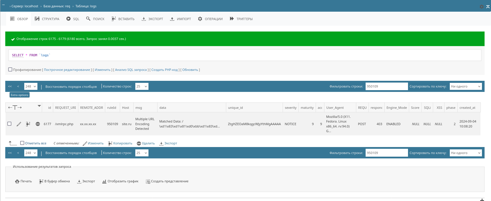
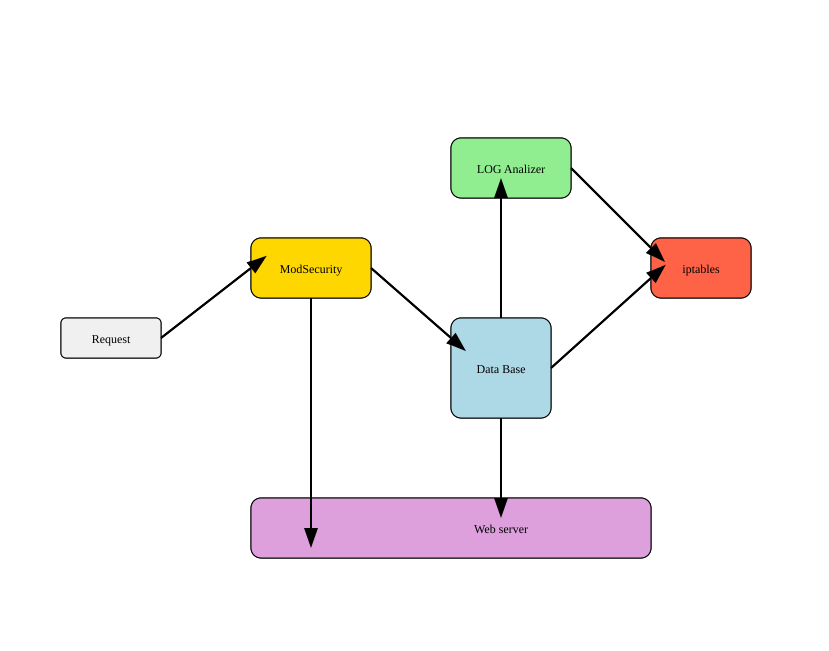

# Apache mod security log parser

Скрипты анализируют логи ModSecurity в режиме SecAuditLogType Concurrent в Apache mod security 2.x, предоставляя возможности для анализа в реальном времени и защиты от DDoS-атак. Скрипт работает на уровне 7 модели OSI, отслеживая ботов и выявляя подозрительное поведение. При обнаружении вредоносных действий, он инициирует блокировку на уровне 3 модели OSI, используя fail2ban и iptables, блокируя IP-адреса злоумышленников на сетевом уровне. Такой подход позволяет быстро реагировать на атаки, эффективно защищая ваш сервер.

[English](README.md)


## Оглавление

- [Описание скрипта mod_sec_log_parser.py](#Описание-скрипта-mod_sec_log_parser)
- [Описание значений полей лог-файла ModSecurity Audit Log, которые извлекаются скриптом](#Описание-значений-полей-лог-файла-ModSecurity-Audit-Log-которые-извлекаются-скриптом)
- [Описание параметра Mutex в конфигурации Apache](#Описание-параметра-Mutex-в-конфигурации-Apache)
- [Описание скрипта watch_dir.sh](#Описание-скрипта-watch_dir)
- [Описание скрипта modsec_recedive.sh - блокировка DDoS атак](#Описание-скрипта-modsec_recedive-блокировка-DDoS-атак)
- [Пример использования Fail2ban](#Пример-использования-Fail2ban)
- [Система безопасности веб-сервера](#Система-безопасности-веб-сервера)
- [Методы защиты от атак с использованием данных из логов ModSecurity 2.9](#Методы-защиты-от-атак-с-использованием-данных-из-логов-ModSecurity)
- [Примеры блокировки или лимитирования на уровне iptables](#Примеры-блокировки-или-лимитирования-на-уровне-iptables)
- [Методы защиты от атак с использованием машинного обучения](#Методы-защиты-от-атак-с-использованием-машинного-обучения)
- [Комплексная система защиты от атак](#Комплексная-система-защиты-от-атак)


Скрипты решают проблемы с использованием глобального мьютекста с модулем Apache2 MPM ITK [issues/454](https://github.com/owasp-modsecurity/ModSecurity/issues/454), [issues/712](https://github.com/owasp-modsecurity/ModSecurity/issues/712)

> Примечание: тестирование проводилось в продакшн среде
```
Producer: ModSecurity for Apache/2.9.2 (http://www.modsecurity.org/); OWASP_CRS/2.2.9.
Server: Apache/2.4.6 (CentOS 7) mpm-itk/2.4.7-04; 1 Core, 2.4GHz, 1Gb RAM.
```

Архитектура проекта подобрана под окружение, в альтернативных конфигурациях проблем с использованием глобального мьютекса не возникает. 


[ModSecurity Handbook: Getting Started: Chapter 4. Logging](https://www.feistyduck.com/library/modsecurity-handbook-free/online/ch04-logging.html)

[owasp-modsecurity / ModSecurity Reference Manual (v2.x)](https://github.com/owasp-modsecurity/ModSecurity/wiki/Reference-Manual-(v2.x))


### Описание скрипта mod_sec_log_parser
Этот скрипт предназначен для обработки и анализа логов, созданных модулем ModSecurity на веб-сервере Apache в режиме SecAuditLogType Concurrent. Он автоматически извлекает ключевые данные из логов, хранящихся в виде отдельных мелких файлов, объединяет их в один лог-файл и записывает информацию в базу данных MySQL для удобного анализа и отчётности. Скрипт также осуществляет очистку обработанных файлов и пустых директорий, поддерживая организованную файловую структуру.


### Основные функции и задачи скрипта:

1. Чтение логов: Скрипт просматривает указанный каталог (/var/log/httpd/modsec_audit/) на наличие файлов логов, созданных модулем ModSecurity, и обрабатывает их.

2. Парсинг данных: Логи разбиваются на ключевые компоненты с использованием заранее определенных регулярных выражений, чтобы извлечь важные данные, такие как метод запроса, URI, адрес клиента, идентификатор правила, сообщения об ошибках и другие сведения, касающиеся запросов.

3. Объединение логов: Все обработанные данные записываются в один общий лог-файл (/var/log/httpd/modsec_audit.log) для удобства хранения и последующего анализа.

4. Подключение к базе данных: Скрипт осуществляет соединение с базой данных MySQL для сохранения извлеченных данных в таблице logs. Это позволяет упростить анализ и отчетность о проблемах, обнаруженных ModSecurity.

5. Запись данных в базу: Извлеченные данные регистрируются в таблице базы данных с фиксированной структурой, что позволяет пользователю отслеживать информацию о безопасности в режиме реального времени.

6. Очистка файлов и директорий: После успешной обработки логов, скрипт удаляет их, чтобы избежать повторной обработки при следующем запуске. Также происходит проверка и удаление пустых подкаталогов, что позволяет поддерживать чистую и организованную файловую структуру.

### Принципы работы

- Регулярные выражения: Для парсинга логов используются регулярные выражения, которые четко определяют, каковы формы данных, которые нужно искать, обеспечивая точное извлечение информации.

- Работа с исключениями: Скрипт учитывает возможные ошибки при подключении к базе данных и читает файлы логов, обеспечивая обработку сбоев без остановки выполнения всей программы.

- Структура данных: Каждая запись в базе данных содержит важные поля, связанные с обработанным логом, включая метод запроса, URI, IP-адрес клиента, уникальный идентификатор ошибки ModSecurity и другие параметры.

### Зависимости

Скрипт требует библиотеку pymysql для взаимодействия с базой данных MySQL. Убедитесь, что она установлена в вашем окружении:

`pip install pymysql`


### Настройки

Перед запуском скрипта убедитесь, что:

- Настройки подключения к базе данных (по умолчанию localhost) правильные, и пользователь имеет соответствующие права доступа к базе modsec_logs.
- Кодировка файла логов (в скрипте используется latin-1) соответствует фактической кодировке. Если вы работаете с логами другой кодировки, убедитесь, что она правильно указана.


### Описание значений полей лог-файла ModSecurity Audit Log которые извлекаются скриптом:


1. REQUEST_METHOD - HTTP-метод запроса (например, GET, POST, PUT, DELETE).

2. REQUEST_URI - URL-адрес запроса, который был обработан веб-сервером.

3. REMOTE_ADDR - IP-адрес клиента, который отправил запрос.

4. Host - Имя хоста, указанное в заголовке Host запроса.

5. User-Agent - Строка агента пользователя, которая идентифицирует браузер или другое устройство клиента.

6. ruleId - Идентификатор правила ModSecurity, которое сработало для этого запроса.

7. msg - Сообщение от ModSecurity, которое описывает, почему правило сработало.

8. data - Данные, которые были обнаружены ModSecurity и привели к срабатыванию правила. Например, это может быть часть URL, заголовок или тело запроса.

9. unique_id - Уникальный идентификатор запроса, который позволяет отслеживать его обработку в логах.

10. severity - Уровень серьезности срабатывания правила ModSecurity. Может быть EMERGENCY (0), ALERT (1), CRITICAL (2), ERROR (3), WARNING (4), NOTICE (5), INFO (6) and DEBUG (7).

11. maturity - Оценка зрелости правила ModSecurity. Обычно используется шкала от 1 до 9, где 1 - самый низкий уровень зрелости, а 9 - самый высокий.

12. accuracy - Оценка точности правила ModSecurity. Обычно используется шкала от 1 до 9, где 1 - самый низкий уровень точности, а 9 - самый высокий.

13. responce_header - Заголовок ответа HTTP, который был отправлен клиенту.

14. Engine-Mode - Режим, в котором работал ModSecurity при обработке запроса.

15. Score - Total Inbound Score: Это общий балл аномалий, вычисленный ModSecurity для данного запроса. Чем выше балл, тем подозрительнее поведение пользователя.

16. SQLi - Количество аномалий, связанных с потенциальными SQL-инъекциями.

17. XSS - Количество аномалий, связанных с потенциальными атаками типа XSS (Cross-Site Scripting).

18. phase - Фаза, этап обработки запроса: Фаза 1: Заголовки запроса, Фаза 2: Тело запроса, Фаза 3: Заголовки ответа, Фаза 4: Тело ответа, Фаза 5: Логирование

19. created_at - Дата и время срабатывания правила ModSecurity в формате ISO 8601.

#### Пример лога ModSecurity:
```
--f3c9d4c6-B--
GET /some/resource HTTP/1.1
Host: example.com
User-Agent: Mozilla/5.0 (Windows NT 10.0; Win64; x64) AppleWebKit/537.36 (KHTML, like Gecko) Chrome/87.0.4280.88 Safari/537.36
--f3c9d4c6-A--
192.168.1.10
[id "944"] [msg "Cross-site scripting attempt blocked"] [data "javascript:alert('malicious');"] [severity "WARNING"] [maturity "4"] [accuracy "4"]
--f3c9d4c6-F--
HTTP/1.1 403 Forbidden
```

##### В этом примере:

- REQUEST_METHOD - GET
- REQUEST_URI - /some/resource
- REMOTE_ADDR - 192.168.1.10
- ruleId - 944
- msg - Cross-site scripting attempt blocked
- data - javascript:alert(‘malicious’);
- severity - WARNING
- responce_header - HTTP/1.1 403 Forbidden

##### Важно:

- Точные поля, которые будут записываться в лог, могут варьироваться в зависимости от конфигурации ModSecurity и версии Apache.
- Обратите внимание на ошибки Apache-Error, так как они могут указать на проблемы с конфигурацией Apache или ModSecurity.
- Используйте эти данные для анализа и отладки безопасности вашего веб-приложения.


### Описание параметра Mutex в конфигурации Apache

Параметр Mutex в конфигурации Apache используется для управления доступом к ресурсам в многопоточной среде. Он позволяет избежать состояний гонки (race conditions) и обеспечивает безопасный доступ к общим ресурсам между разными процессами или потоками.

#### Синтаксис
`Mutex file:/var/run/mod_security default`

Строка указывает на использование файлового мьютекса, который будет храниться в директории /var/run/mod_security/. Важно, чтобы эта директория существовала и имела правильные права доступа, так как она будет использоваться для создания файла мьютекса.

#### Права доступа
Так как мьютекс является глобальным ресурсом, каталог, в котором создается файл мьютекса, должен иметь права доступа, позволяющие всем необходимым процессам (например, веб-серверу и модулям) взаимодействовать с ним. Это означает, что права на каталог должны быть установлены так, чтобы все пользователи, которым необходимо использовать этот мьютекс, могли его читать, записывать и выполнять поиск.

Пример команды для установки прав:
```
chmod 770 /var/run/mod_security
chown <owner>:<group> /var/run/mod_security
```

Замените <owner> и <group> на соответствующие значения для вашего окружения. В данном примере каталог с мьютексом должен быть доступен для чтения, записи и поиска для владельца и группы, в которой состоят пользователи Apache 2, назначенные через AssignUserId в MPM ITK.

#### Как работает Mutex
1. **Создание мьютекса:** При старте Apache модуль ModSecurity создает файл мьютекса в указанной директории. Этот файл служит индикатором того, что ресурс занят.
2. **Блокировка ресурсов:** Когда один из процессов или потоков пытается получить доступ к ресурсу (например, к конфигурации правил ModSecurity), он обращается к этому мьютексу. Если другой процесс уже использует этот ресурс, текущий процесс будет заблокирован до тех пор, пока ресурс не станет доступным.
3. **Освобождение мьютекса:** После завершения работы с ресурсом процесс освобождает мьютекс, позволяя другим процессам продолжать выполнение.

### Участие в логах ModSecurity
Мьютекс также играет важную роль в работе с логами ModSecurity:
- **Синхронизация записей:** Когда несколько процессов Apache обрабатывают запросы одновременно, они могут пытаться записать логи в один и тот же файл. Мьютекс обеспечивает синхронизацию этих операций, предотвращая повреждение данных в логах из-за одновременной записи.
- **Предотвращение конфликтов:** Без использования мьютекса возможны ситуации, когда один процесс может перезаписать данные, которые другой процесс пытается записать, что приводит к потерям информации или некорректным записям.

Таким образом, использование параметра Mutex в конфигурации Apache для ModSecurity помогает обеспечить стабильность и целостность работы сервера в многопоточной среде, а также корректность ведения логов.


### Описание скрипта watch_dir

Этот скрипт предназначен для мониторинга и управления правами доступа к директориям, где хранятся логи, создаваемые модулем ModSecurity на веб-сервере Apache. В режиме SecAuditLogType Concurrent модуль ModSecurity создает лог-файлы с правами, установленными пользователем, назначенным процессу Apache 2 через директиву AssignUserId с модулем MPM ITK. 

#### Основные функции скрипта:

- Мониторинг директории: Скрипт использует inotifywait для постоянного отслеживания в указанной директории (/var/log/httpd/modsec_audit/) на наличие новых файлов или подкаталогов.

- Обработка новых подкаталогов: При создании нового подкаталога скрипт изменяет его права доступа и владельца, устанавливая права 770 и назначая владельцем пользователя apache и группу fastsecure. Это позволяет другим пользователям и скриптам без проблем создавать файлы и подкаталоги внутри отслеживаемой директории.

- Управление процессами: Скрипт проверяет, выполняется ли он уже, используя PID-файл, предотвращая запуск нескольких экземпляров одновременно.

- Логгирование: Скрипт ведет запись в лог-файл (/var/log/httpd/watch_dir.log), фиксируя обработку новых подкаталогов.

- Очистка ресурсов: В случае прерывания (например, SIGINT или SIGTERM), скрипт корректно завершает работу и удаляет PID-файл.

Этот скрипт обеспечивает управление безопасностью и доступом к директориям, упрощая работу с логами ModSecurity, что делает его идеальным инструментом для администраторов веб-серверов.

### Описание скрипта modsec_recedive блокировка DDoS атак


Запуск в фоновом режиме:
```
nohup /root/modsec_recedive.sh &
```

### Описание:

Этот скрипт (modsec_recedive.sh) предназначен для мониторинга логов ModSecurity и блокировки IP-адресов, которые совершают многократные атаки.

#### Архитектура:

- ModSecurity: Модуль Apache, который анализирует входящий трафик и блокирует вредоносные запросы.
- ModSec Recedive: Скрипт, который анализирует логи ModSecurity, определяет частоту атак с определенного IP-адреса и блокирует IP-адреса, превысившие заданный порог.
- Fail2ban: Программа, которая использует правила для блокировки IP-адресов, которые совершают многократные атаки на определенный сервис.

#### Как использовать:

- Настройка ModSecurity: Убедитесь, что ModSecurity установлен и настроен на запись логов в директорию "/var/log/httpd/modsec_audit/".
- Установка скрипта: Сохраните скрипт modsec_recedive.sh в желаемое место.
- Настройка параметров:
- - WATCH_DIR: Путь к директории с логами ModSecurity.
- - LOG_FILE: Путь к файлу, где хранится информация о количестве атак с каждого IP.
- - RECEDIVE_FILE: Путь к файлу, где хранятся IP-адреса, которые нужно заблокировать.
- - TIMEOUT: Период времени (в секундах), после которого информация об атаках из логов ModSecurity удаляется.
- - ATTACK_THRESHOLD: Число атак с одного IP-адреса, после которого он попадает в RECEDIVE_FILE и может быть заблокирован.
- Запуск скрипта: Запустите скрипт: ./modsec_recedive.sh.
- Настройка Fail2ban (необязательно): Создайте файл правил Fail2ban, который будет использовать информацию из RECEDIVE_FILE для блокировки IP-адресов.

#### Пример использования Fail2ban:

Чтобы настроить Fail2Ban для блокировки IP-адресов на основе записей в вашем пользовательском файле журнала ModSecurity (/var/log/httpd/modsec_recedive.log), вам нужно создать пользовательский фильтр и настроить jail в Fail2Ban. Вот как это сделать:


##### Шаг 1: Создайте пользовательский фильтр

Создайте файл пользовательского фильтра для Fail2Ban. Этот файл укажет Fail2Ban, как анализировать ваш файл журнала.

1. Создайте файл фильтра:

   Вы можете создать новый файл фильтра с именем modsec_recedive.conf в каталоге /etc/fail2ban/filter.d/:

   ```
   sudo nano /etc/fail2ban/filter.d/modsec_recedive.conf
   ```

2. Определите фильтр:

   Добавьте следующее содержимое в файл modsec_recedive.conf. Этот шаблон регулярного выражения извлечет IP-адреса из вашего журнала:

   ```
   [Definition]
   failregex = ^<HOST> - \d{4}-\d{2}-\d{2} \d{2}:\d{2}:\d{2}$
   ignoreregex =
   datepattern = ^%%Y-%%m-%%d %%H:%%M:%%S
   ```


##### Шаг 2: Настройте тюрьму

Теперь вам нужно настроить тюрьму для этого фильтра в Fail2Ban.

1. Отредактируйте конфигурацию тюрьмы:

   Откройте конфигурационный файл jail Fail2Ban. Вы можете либо отредактировать основной конфигурационный файл, либо создать отдельный локальный конфигурационный файл:

   ```
   sudo nano /etc/fail2ban/jail.local
   ```

2. Добавьте конфигурацию jail:

   Добавьте следующую конфигурацию для вашей пользовательской jail:

   ```
   [modsec-recedive]
   enabled  = true
   port     = http,https
   filter   = modsec_recedive
   logpath  = /var/log/httpd/modsec_recedive.log
   maxretry = 3
   bantime  = 3600
   findtime = 600
   ```

##### Шаг 3: Перезапустите Fail2Ban

После настройки фильтра и jail перезапустите Fail2Ban, чтобы применить изменения:
```
sudo systemctl restart fail2ban
```

##### Шаг 4: Проверьте конфигурацию

Вы можете проверить, что ваша конфигурация работает, проверив статус Fail2Ban и убедившись, что правило активно:
```
sudo fail2ban-client status modsec-recedive
```

Эта команда должна показать текущий статус jail, включая любые IP, которые были заблокированы.

##### Дополнительные замечания

- Убедитесь, что файл журнала /var/log/httpd/modsec_recedive.log корректно обновляется ModSecurity.
- Убедитесь, что у Fail2Ban есть необходимые разрешения для чтения файла журнала.
- Протестируйте ваш шаблон регулярного выражения с примерами записей журнала, чтобы убедиться, что он правильно соответствует.
- Настройте значения maxretry, bantime и findtime в соответствии с вашими потребностями в безопасности.

Следуя этим шагам, вы сможете настроить Fail2Ban для мониторинга вашего пользовательского журнала ModSecurity и блокировки IP-адресов, которые появляются слишком часто.

#### Преимущества:

- Уменьшение ложных срабатываний: Мониторинг количества атак с одного IP-адреса позволяет сократить ложные срабатывания и блокировать только действительно злонамеренные действия.
- Более эффективная защита: Блокировка IP-адресов, которые совершают многократные атаки, снижает нагрузку на сервер и повышает уровень защиты.
- Гибкая настройка: Вы можете легко настраивать параметры скрипта в соответствии с потребностями вашей системы.


### Директивы конфигурации ModSecurity

Следующие директивы являются ключевыми для правильного функционирования модуля ModSecurity на вашем веб-сервере Apache. Эти настройки обеспечивают эффективную работу системы аудита, особенно в режиме Concurrent SecAuditLogType.

#### Директивы конфигурации:
```
<IfModule mod_security2.c>
    # Эта директива указывает тип аудита.
    SecAuditLogType Concurrent
    
    # Устанавливает права доступа к директории для аудита.
    SecAuditLogDirMode 0777
    
    # Устанавливает права доступа к файлам аудита.
    SecAuditLogFileMode 0600

    # Эти директивы определяют временную директорию и директорию данных для ModSecurity.
    SecTmpDir /var/lib/mod_security
    SecDataDir /var/lib/mod_security
    
    # Указывает директорию для хранения аудита.
    SecAuditLogStorageDir /var/log/httpd/modsec_audit
</IfModule>
```

#### Объяснение директив:

- **SecAuditLogType Concurrent**: Эта директива устанавливает тип аудита в Concurrent, позволяя нескольким процессам одновременно записывать логи без конфликтов.

- **SecAuditLogDirMode 0777**: Устанавливает права доступа к директории аудита, позволяя полный доступ всем пользователям. Это необходимо для параллельной записи, но должно быть осторожно управляемо для поддержания безопасности.

- **SecAuditLogFileMode 0600**: Ограничивает доступ к файлам аудита, позволяя только владельцу (обычно пользователю Apache) читать и записывать в эти файлы, что повышает уровень безопасности.

- **SecTmpDir и SecDataDir**: Эти директивы указывают временные и данные директории, используемые ModSecurity. Они должны быть установлены на соответствующие пути, где ModSecurity может безопасно хранить временные файлы.

- **SecAuditLogStorageDir**: Определяет директорию, где будут храниться аудиторские логи. Убедитесь, что у этой директории установлены правильные права доступа для корректного ведения логов.

#### Важное примечание:
Обязательно просмотрите и настройте права доступа в соответствии с вашими политиками безопасности. Хотя 0777 позволяет гибко вести параллельные записи, это может представлять собой риски безопасности, если не контролировать ситуацию.


### Система безопасности веб-сервера



- Request - точка входа запросов в систему.
- ModSecurity - первый уровень защиты, через который проходит входящий трафик.
- Data Base - взаимодействует с ModSecurity и анализатором логов.
- LOG Analizer - получает данные из базы данных и отправляет правила в iptables.
- iptables - получает данные от анализатора логов и базы данных для правил фильтрации.
- Web server - конечная точка для обработки запросов.

#### Преимущества использования файла в качестве простой базы данных:

1. Простота реализации - не требуется отдельная СУБД
2. Низкие накладные расходы на операции чтения/записи
3. Легкость резервного копирования - просто копирование файла
4. Возможность использовать стандартные утилиты Linux для обработки (grep, sed, awk)

#### Кэширование файлов в Linux:

1. При чтении файла данные попадают в page cache (часть "грязной" памяти)
2. Последующие операции чтения обслуживаются из кэша, что ускоряет доступ
3. При записи данные сначала попадают в кэш, а затем асинхронно записываются на диск
4. Linux старается использовать свободную память для кэширования, чтобы ускорить работу с файлами
5. "Грязные" страницы (измененные, но не записанные на диск) периодически синхронизируются

Это обеспечивает хорошую производительность для часто используемых файлов.

#### Методы защиты от атак с использованием данных из логов ModSecurity

1. Динамические черные списки в базе данных:
   - Создайте таблицу в БД для хранения подозрительных IP-адресов.
   - При превышении определенного порога Score или частоты запросов, добавляйте IP в черный список.
   - Периодически синхронизируйте этот список с правилами iptables.

2. Адаптивные правила ModSecurity:
   - Храните дополнительные правила в БД.
   - На основе анализа логов (например, частых срабатываний определенных ruleId) динамически активируйте или деактивируйте правила.
   - Используйте скрипты для автоматического обновления конфигурации ModSecurity.

3. Временные блокировки с эскалацией:
   - Реализуйте систему временных блокировок в БД.
   - При первом нарушении блокируйте IP на короткий период, увеличивая время блокировки при повторных нарушениях.
   - Синхронизируйте эти блокировки с iptables.

4. Анализ паттернов запросов:
   - Сохраняйте историю REQUEST_URI и REQUEST_METHOD для каждого IP в БД.
   - Выявляйте подозрительные паттерны (например, систематическое сканирование).
   - При обнаружении аномалий, применяйте более строгие правила ModSecurity или блокируйте через iptables.

5. Распределенная защита:
   - Используйте распределенную БД для обмена информацией между несколькими серверами.
   - Синхронизируйте данные о атаках и подозрительной активности.
   - Применяйте общие правила защиты на всех серверах.

6. Интеллектуальное ограничение скорости:
   - Храните в БД историю запросов для каждого IP.
   - Динамически настраивайте лимиты на основе User-Agent, исторического поведения и текущей нагрузки.
   - Реализуйте это через комбинацию правил ModSecurity и iptables.

7. Анализ аномалий в заголовках:
   - Создайте в БД профили нормальных заголовков для разных типов клиентов.
   - Сравнивайте входящие заголовки с этими профилями.
   - При обнаружении аномалий, увеличивайте Score или применяйте дополнительные проверки.

8. Геолокационная фильтрация:
   - Храните в БД информацию о геолокации IP-адресов.
   - Настройте правила ModSecurity для применения разных уровней проверки в зависимости от страны происхождения запроса.
   - Используйте iptables для блокировки трафика из стран с высоким риском.

9. Анализ последовательности действий:
   - Сохраняйте в БД последовательность действий пользователей (на основе unique_id).
   - Выявляйте нетипичные последовательности, которые могут указывать на автоматизированные атаки.
   - Применяйте дополнительные проверки или блокировки при обнаружении аномалий.

10. Репутационная система:
    - Создайте в БД систему репутации для IP-адресов и User-Agent.
    - Учитывайте историю запросов, срабатываний правил и успешных атак.
    - Используйте эту репутацию для настройки уровня проверок в ModSecurity и правил iptables.

11. Анализ payload'а запросов:
    - Сохраняйте в БД хеши или сигнатуры подозрительных payload'ов из поля data.
    - Используйте эту информацию для создания динамических правил ModSecurity.
    - При обнаружении известных вредоносных паттернов, немедленно блокируйте источник через iptables.

12. Временной анализ:
    - Храните в БД статистику запросов по времени суток и дням недели.
    - Выявляйте аномальные всплески активности.
    - Автоматически ужесточайте правила ModSecurity и iptables в периоды повышенного риска.

13. Интеграция с внешними источниками данных:
    - Периодически обновляйте локальную БД данными из внешних источников о известных угрозах.
    - Используйте эту информацию для обновления правил ModSecurity и iptables.

14. Анализ соотношения успешных и неуспешных запросов:
    - Отслеживайте в БД соотношение запросов с разными кодами ответов для каждого IP.
    - Выявляйте IP-адреса с аномально высоким процентом ошибок.
    - Применяйте дополнительные проверки или ограничения к таким адресам.

15. Адаптивная настройка severity:
    - Анализируйте эффективность правил с разными уровнями severity.
    - Динамически корректируйте уровни severity в зависимости от текущей ситуации и исторических данных.
    - Используйте эту информацию для приоритизации обработки событий и настройки автоматических реакций.

Эти подходы позволяют создать многоуровневую, адаптивную систему защиты, которая использует преимущества ModSecurity, баз данных и iptables, обеспечивая гибкую и эффективную защиту от различных типов атак, включая DDoS.


#### Примеры блокировки или лимитирования на уровне iptables

1. Блокировка новых соединений от конкретного IP-адреса:

     ```
     iptables -A INPUT -p tcp -m state --state NEW -s [REMOTE_ADDR] -j DROP
     ```
     
2. Ограничение скорости новых соединений (Rate Limiting):

     ```
    iptables -A INPUT -p tcp -m state --state NEW -m limit --limit 10/minute --limit-burst 15 -j ACCEPT
    iptables -A INPUT -p tcp -m state --state NEW -j DROP
     ```
Это правило позволяет не более 10 новых соединений в минуту с возможностью краткосрочного всплеска до 15 соединений.

3. Замедление новых соединений:

     ```
    iptables -A INPUT -p tcp -m state --state NEW -m hashlimit --hashlimit-above 5/min --hashlimit-burst 10 --hashlimit-mode srcip --hashlimit-name conn_rate_limit -j ACCEPT
    iptables -A INPUT -p tcp -m state --state NEW -j DROP
     ```

Это правило ограничивает количество новых соединений до 5 в минуту для каждого IP-адреса, с возможностью краткосрочного всплеска до 10 соединений.


4. Блокировка новых соединений на основе Score:
     ```
    # Пример скрипта, который читает логи и блокирует новые соединения при высоком Score
    if [[ $Score -gt 50 ]]; then
        iptables -A INPUT -p tcp -m state --state NEW -s $REMOTE_ADDR -j DROP
    fi
     ```
     
5. Временная блокировка новых соединений при обнаружении SQL-инъекций или XSS:

     ```
    if [[ $SQLi -gt 0 || $XSS -gt 0 ]]; then
        iptables -A INPUT -p tcp -m state --state NEW -s $REMOTE_ADDR -j DROP
        # Удалить правило через 10 минут
        (sleep 600; iptables -D INPUT -p tcp -m state --state NEW -s $REMOTE_ADDR -j DROP) &
    fi
     ```

Эти правила будут влиять только на пакеты, инициирующие новые соединения, не затрагивая уже установленные соединения. Это может быть полезно для предотвращения атак, не нарушая при этом работу легитимных пользователей, уже подключенных к системе.

Важно отметить, что эти правила должны применяться осторожно и регулярно пересматриваться, чтобы избежать блокировки легитимного трафика. Также рекомендуется использовать  системы анализа и защиты, такие как fail2ban или собственные скрипты, которые могут анализировать логи ModSecurity в реальном времени и динамически обновлять правила iptables.


#### Методы защиты от атак с использованием машинного обучения


1. Аномальное обнаружение:
   - Используйте алгоритмы типа Isolation Forest или One-Class SVM для выявления аномальных запросов.
   - Признаки: Score, SQLi, XSS, частота запросов от REMOTE_ADDR, время между запросами.


 > Isolation Forest: Алгоритм для обнаружения аномалий, который изолирует выбросы в данных. Эффективен для выявления необычных запросов.

 > One-Class SVM (Support Vector Machine): Метод обнаружения аномалий, который учится на нормальных данных и выявляет отклонения. Полезен для идентификации нетипичных веб-запросов.


2. Классификация запросов:
   - Примените алгоритмы Random Forest или Gradient Boosting для классификации запросов на легитимные и вредоносные.
   - Признаки: REQUEST_METHOD, REQUEST_URI, User-Agent, Score, SQLi, XSS, severity, maturity, accuracy.
  

 > Random Forest: Ансамблевый метод, использующий множество деревьев решений. Хорош для классификации запросов на легитимные и вредоносные.

 > Gradient Boosting: Ансамблевый метод, последовательно обучающий слабые модели. Эффективен для точной классификации и ранжирования рисков запросов.  

3. Кластеризация:
   - Используйте K-means или DBSCAN для группировки схожих запросов и выявления паттернов атак.
   - Признаки: REQUEST_METHOD, REQUEST_URI, REMOTE_ADDR, User-Agent, Score.


 > K-means: Алгоритм кластеризации, группирующий похожие объекты. Может использоваться для выявления групп схожих запросов или атак.

 > DBSCAN (Density-Based Spatial Clustering of Applications with Noise): Алгоритм кластеризации, основанный на плотности. Полезен для выявления кластеров запросов необычной формы и выбросов.


4. Временные ряды:
   - Примените ARIMA или LSTM для анализа временных паттернов в запросах.
   - Признаки: created_at, Score, количество запросов от REMOTE_ADDR.


 > ARIMA (AutoRegressive Integrated Moving Average): Модель для анализа временных рядов. Может использоваться для прогнозирования трафика и выявления аномальных паттернов во времени.

 > LSTM (Long Short-Term Memory): Тип рекуррентной нейронной сети, способный обучаться долгосрочным зависимостям. Эффективен для анализа последовательностей запросов и выявления сложных временных паттернов атак.


5. Обучение с подкреплением:
   - Разработайте систему, которая динамически настраивает правила ModSecurity на основе обратной связи.
   - Состояние: текущие настройки правил; Действия: изменение правил; Награда: снижение количества атак.

6. Ансамблевые методы:
   - Комбинируйте результаты нескольких моделей для повышения точности обнаружения атак.

7. Автоэнкодеры:
   - Используйте для сжатия данных запроса и выявления аномалий в сжатом пространстве.

8. Рекуррентные нейронные сети:
   - Анализируйте последовательности запросов для выявления сложных паттернов атак.

9. Обработка естественного языка:
   - Применяйте методы NLP для анализа полей REQUEST_URI и User-Agent.

10. Графовые нейронные сети:
    - Моделируйте взаимосвязи между запросами и IP-адресами как граф для выявления сложных атак.

11. Онлайн-обучение:
    - Используйте алгоритмы, способные обучаться в реальном времени, для адаптации к новым типам атак.

12. Генеративные состязательные сети (GAN):
    - Генерируйте синтетические примеры атак для улучшения обнаружения.

13. Трансферное обучение:
    - Используйте предобученные модели на больших наборах данных о веб-атаках и дообучайте их на ваших данных.

14. Активное обучение:
    - Выбирайте наиболее информативные примеры для разметки экспертами и дообучения моделей.

15. Мультизадачное обучение:
    - Обучайте модель одновременно классифицировать тип атаки и оценивать ее серьезность.

Для реализации этих подходов можно использовать библиотеки машинного обучения, такие как scikit-learn, TensorFlow или PyTorch, интегрируя их с системой обработки логов ModSecurity и механизмами принятия решений для обновления правил и настроек файрвола.


#### Комплексная система защиты от атак


##### Обнаружение аномального поведения:
```
SELECT REMOTE_ADDR, COUNT(*) as request_count
FROM modsec_logs
WHERE created_at > UNIX_TIMESTAMP(NOW()) - 300
GROUP BY REMOTE_ADDR
HAVING request_count > 100;
```
Этот запрос выявляет IP-адреса, сделавшие более 100 запросов за последние 5 минут, что может указывать на DDoS-атаку.

##### Анализ подозрительных User-Agent:
```
SELECT User_Agent, COUNT(*) as ua_count
FROM modsec_logs
WHERE created_at > UNIX_TIMESTAMP(NOW()) - 86400
GROUP BY User_Agent
HAVING ua_count > 1000
ORDER BY ua_count DESC;
```
Этот запрос поможет выявить подозрительные User-Agent, которые делают слишком много запросов.

##### Мониторинг высоких Score:
```
SELECT REMOTE_ADDR, AVG(Score) as avg_score
FROM modsec_logs
WHERE created_at > UNIX_TIMESTAMP(NOW()) - 3600
GROUP BY REMOTE_ADDR
HAVING avg_score > 50;
```
Этот запрос выявляет IP-адреса с высоким средним Score, что может указывать на вредоносную активность.

##### Отслеживание SQL-инъекций и XSS-атак:
```
SELECT REMOTE_ADDR, SUM(SQLi) as total_sqli, SUM(XSS) as total_xss
FROM modsec_logs
WHERE created_at > UNIX_TIMESTAMP(NOW()) - 86400
GROUP BY REMOTE_ADDR
HAVING total_sqli > 10 OR total_xss > 10;
```
Этот запрос выявляет IP-адреса с высоким количеством попыток SQL-инъекций или XSS-атак.

##### Анализ частоты запросов по методам:
```
SELECT REQUEST_METHOD, COUNT(*) as method_count
FROM modsec_logs
WHERE created_at > UNIX_TIMESTAMP(NOW()) - 3600
GROUP BY REQUEST_METHOD
ORDER BY method_count DESC;
```
Этот запрос поможет выявить аномальное использование определенных HTTP-методов.

##### Общие стратегии и подходы:

- Использование машинного обучения для создания моделей нормального поведения и выявления аномалий.

- Создание временных рядов для анализа трендов и сезонности в данных логов.

- Применение кластеризации для группировки схожих запросов и выявления потенциальных атак.

- Использование iptables для автоматической блокировки IP-адресов, определенных как вредоносные на основе анализа логов.

- Динамическое обновление правил ModSecurity на основе результатов анализа.

- Создание системы репутации IP-адресов и User-Agent на основе исторических данных.

- Использование временных окон разной длительности для анализа краткосрочных и долгосрочных паттернов.

- Комбинирование различных метрик (Score, SQLi, XSS, частота запросов) для создания комплексной оценки риска.

- Анализ корреляций между различными полями для выявления сложных паттернов атак.

- Создание системы оповещений на основе пороговых значений различных метрик.

Эти подходы можно реализовать, комбинируя SQL-запросы к базе данных MySQL, правила ModSecurity, настройки iptables и алгоритмы машинного обучения для создания комплексной системы защиты от атак.

 
